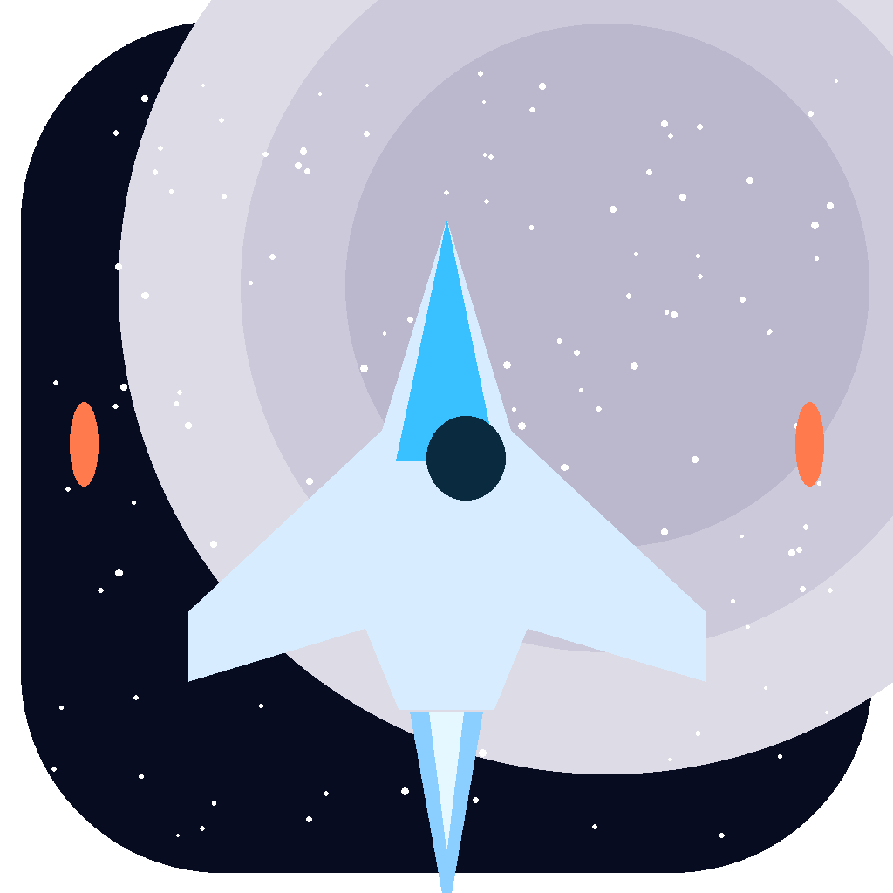
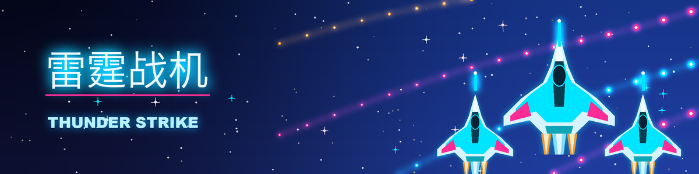
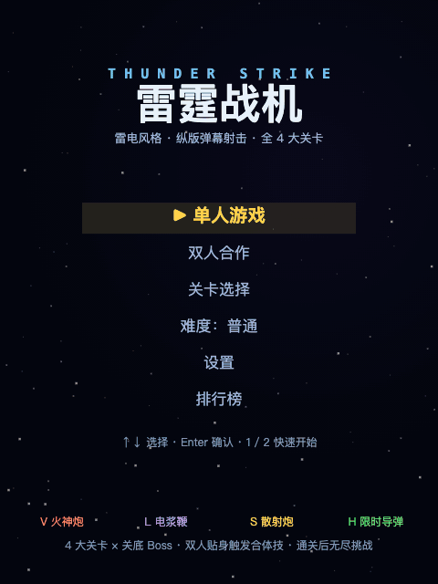
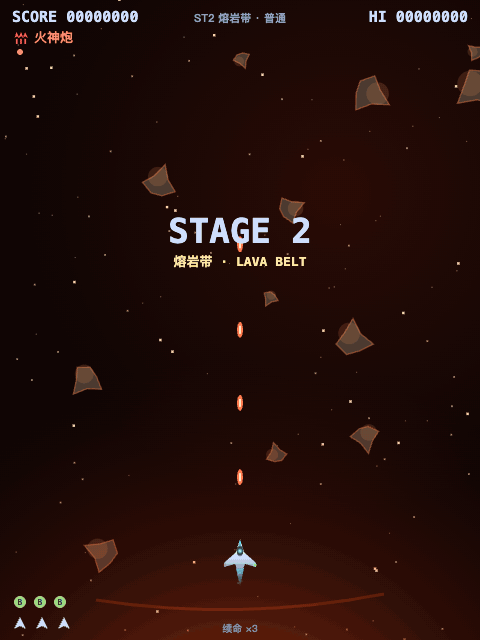
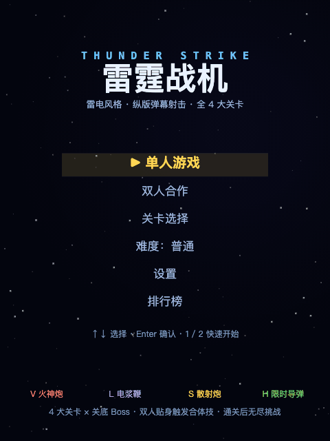
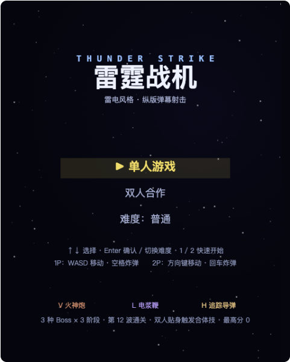
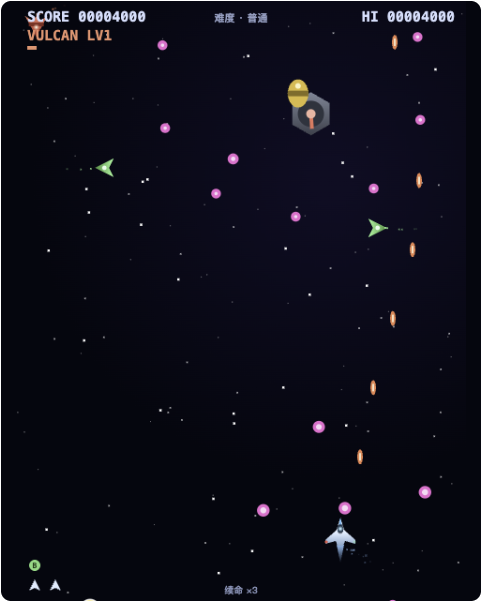
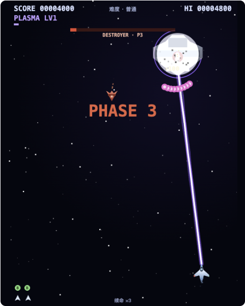

# 雷霆战机 Thunder Strike






雷电2 风格的纵版弹幕射击游戏。单文件 HTML5 实现，vanilla JS + Canvas 2D 渲染、WebAudio 全合成音乐与音效，**零外部依赖、无需构建、无需联网**，下载即玩。

---

## 特性

- **单人与本地双人合作**：双人同屏协作，双人贴身 0.6 秒触发 **FUSION 合体**——合体期间火力强化并喷射全向弹幕
- **三种常驻武器 + 限时导弹道具**
  - 火神炮：散射弹幕，近距压制
  - 电浆鞭：锁定敌人后弹簧物理甩鞭激光，视觉与打击感拉满
  - 散射炮：多路扇形弹幕，覆盖面最广
  - 追踪导弹（限时道具）：自动索敌 + 近炸引信范围伤害，倒计时结束自动失效
- **4 大关卡 × 独立主题与音乐**：深空巡航 → 熔岩带 → 翡翠遗迹 → 虚空核心，每关专属背景、配色、敌机编队与背景音轨，关底 Boss 登场有全屏 WARNING 警报演出
- **护盾兵重做**：持盾敌机的能量盾可被集火击破，破盾后才能伤到本体
- **道具系统**：补给机掉落限时追踪导弹 / 临时护盾 / 炸弹等道具，全部图标化展示；炸弹爆炸后溅射碎片二次杀伤
- **最高分榜 + 街机留名**：本地 Top 10 排行榜，上榜后逐位输入三字母留名
- **关卡选择**：已解锁关卡可随时重打，练习模式还能自选初始武器
- **设置界面**：画面尺寸四档（480×640 ～ 960×1280）+ 音乐 / 音效音量独立调节，自动持久化
- **四档难度**：从休闲到硬核，敌机密度与弹幕压力逐级提升
- **WebAudio 全合成音频**：各关卡独立音序器音轨 + Boss 战音乐自动切换，全部音效由振荡器与噪声实时合成，无任何音频资源文件
- **通关与无尽模式**：通关后有结算场景；也可按 C 续命进入无尽挑战，冲击本地最高分
- **手机竖屏支持**：画布内半透明虚拟摇杆控制移动，右侧提供导弹 / 炸弹按钮，右上角可暂停；画布跟随手机实际可视区域缩放

## 游戏截图 / Screenshots

**实战演示 · 第 1 关**



**第 2 关「熔岩带」主题**



**双人 FUSION 合体技 · 全向弹幕**



| 主菜单 | 战斗画面 | Boss 战 |
| --- | --- | --- |
|  |  |  |

## 操作说明

| 操作 | 1P | 2P |
| --- | --- | --- |
| 移动 | W / A / S / D | 方向键 |
| 炸弹 | 空格 | 回车 |
| 暂停 / 暂停菜单 | P 或 Esc | P 或 Esc |
| 续命 / 进入无尽 | C | C |

移动端使用竖屏模式：左下控制区首次落点会自动吸附为模拟摇杆中心，右侧释放导弹和炸弹，暂停键位于右上角。摇杆带死区和渐进力度，画布会根据移动浏览器的实际可视区域自动缩放；横屏时会提示旋转回竖屏。

## 快速开始

### Web 版（推荐）

下载仓库后，直接双击 `web/index.html` 即可在浏览器中游玩。

- 无需构建、无需安装依赖、无需联网
- 支持 Chrome / Edge / Firefox / Safari 等现代浏览器

### Mac 版（原生 App 壳）

```bash
cd mac
bash build.sh
```

生成 `mac/雷霆战机.app`，双击即玩。要求：macOS 12+，已安装 Xcode 命令行工具（`xcode-select --install`）。详见 [mac/README.md](mac/README.md)。

## 目录结构

```
thunder-strike-game/
├── README.md            # 本文件
├── LICENSE              # MIT 许可证
├── CONTRIBUTING.md      # 贡献指南
├── .gitignore
├── web/
│   └── index.html       # 游戏本体（单文件，全部逻辑/渲染/音频合成都在其中）
├── assets/              # README 用截图 / 演示 GIF / 图标与 Banner
├── tools/               # GIF 录制工具（record_gif.py + recorder.html）等开发辅助脚本
└── mac/
    ├── main.swift       # Swift + WKWebView 原生壳
    ├── Info.plist       # App 元信息
    ├── icon_1024.png    # 图标原图（构建时生成 .icns）
    ├── build.sh         # 一键构建脚本
    └── README.md        # Mac 版构建说明
```

## 技术要点

- **Canvas 2D**：全部游戏画面（机体、弹幕、爆炸、4 套关卡主题背景）由 Canvas 2D 矢量绘制，无贴图资源
- **WebAudio 音序器**：每关独立 chiptune 音轨（标题 / 4 大关卡 / Boss）由 WebAudio 振荡器实时音序播放，场景切换自动切轨；射击、爆炸、拾取等音效全部程序合成
- **弹簧物理甩鞭**：电浆鞭使用弹簧-阻尼物理模拟鞭体节点，锁定目标后甩出弧线激光
- **对象池与近炸引信**：弹幕与粒子使用对象池复用；限时追踪导弹带近炸引信，进入范围即引爆造成 AoE 伤害
- **统一 Web / Mac 外壳**：Web 与 Swift WKWebView 壳共用同一套全屏游戏 UI；Mac 端仅处理窗口尺寸与本地打包，默认 600×800，ad-hoc 签名后即可双击运行

## 贡献

欢迎提交 Issue 和 Pull Request，请先阅读 [CONTRIBUTING.md](CONTRIBUTING.md)。

## License

[MIT](LICENSE) © 2026 SparkMilkway

---

## English

**Thunder Strike** (雷霆战机) is a Raiden II–style vertical bullet-hell shmup in a **single HTML file** — vanilla JS + Canvas 2D rendering, fully synthesized WebAudio music and SFX, zero external dependencies. Download and play, no build, no network required.

### Features

- Solo and **local 2-player co-op** — fly wing-to-wing for 0.6 s to trigger **FUSION**: boosted firepower plus an omni-directional barrage
- **Three permanent weapons + a time-limited missile item**: Vulcan spread shot, plasma whip (lock-on, spring-physics whip laser), scatter cannon (wide fan barrage), plus homing missiles with proximity-fuse AoE that expire on a timer
- **4 stages, each with its own theme and music track**: Deep Space Cruise → Lava Belt → Emerald Ruins → Void Core, with unique backgrounds, palettes, enemy waves, and a full-screen WARNING cinematic before every boss
- **Reworked shield troopers**: energy shields must be broken before the carrier takes damage
- **Item system**: supply carriers drop time-limited homing missiles, temporary shields, bombs and more — all shown as icons; bombs scatter damaging fragments
- **High-score board + arcade name entry**: local Top 10 with three-letter initials
- **Stage select**: replay any unlocked stage; practice mode lets you pick your starting weapon
- **Settings screen**: 4 display sizes (480×640 up to 960×1280) plus independent music/SFX volume, persisted automatically
- **4 difficulty levels**, from casual to bullet-hell
- Fully synthesized WebAudio music (per-stage tracks + boss theme, auto-switching) and procedural SFX
- **Ending + endless mode**: clear the game for the ending scene, or press C to continue into endless mode
- Touch controls: drag to move, dedicated homing / bomb / pause buttons, plus double-tap to bomb

### Controls

| Action | Player 1 | Player 2 |
| --- | --- | --- |
| Move | W / A / S / D | Arrow keys |
| Bomb | Space | Enter |
| Pause menu | P or Esc | P or Esc |
| Continue / Endless | C | C |

Mobile supports drag movement and auto-fire, with dedicated homing, bomb, and pause controls.

### Quick Start

- **Web**: download the repo and double-click `web/index.html` — that's it. No build, no dependencies, works offline in any modern browser.
- **macOS**: `cd mac && bash build.sh` to produce `mac/雷霆战机.app` (requires Xcode Command Line Tools). See [mac/README.md](mac/README.md).

### Tech Highlights

- Canvas 2D vector rendering — no image assets at all, including the 4 themed stage backgrounds
- WebAudio sequencer: per-stage chiptune tracks plus a boss theme with automatic scene switching; every sound effect is synthesized from oscillators and noise
- Spring-damper physics for the plasma whip
- Object pooling for bullets/particles; proximity-fuse homing missiles
- Unified full-screen UI shared by Web and the Swift WKWebView shell; the macOS wrapper handles local packaging and the 600×800 default window contract

### License

[MIT](LICENSE) © 2026 SparkMilkway
